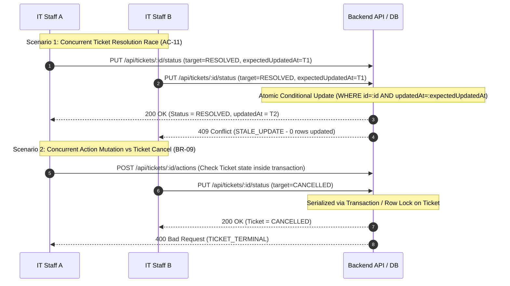

# Sprint 4 Engineering Test Strategy & Traceability Matrix: TokTickIT Actions Taken, Role Dashboards, Final Workflow, and Product Hardening

- **System Name**: TokTickIT
- **Sprint / Lab**: Lab 4 (Sprint 4)
- **Document Status**: Approved Engineering Test Strategy & Traceability Matrix
- **Repository Branch**: `feature/lab4-test-dd`

---

## 1. Executive Summary & Test Strategy Scope

This document establishes the authoritative Test Strategy and Requirement Traceability Matrix for **TokTickIT Lab 4 (Sprint 4)**. Every Functional Requirement (**FR-01** to **FR-15**), Business Rule (**BR-01** to **BR-17**), Acceptance Criterion (**AC-01** to **AC-23**), and Dashboard Metric Card is mapped to concrete, executable unit, integration/API, client UI component, responsive, accessibility, performance-smoke, or Playwright E2E tests.

### Test Strategy Principles
1. **Zero Unmapped Criteria**: 100% of Acceptance Criteria, Functional Requirements, and Business Rules have at least one explicit automated or manual test case.
2. **Explicit Negative & Boundary Testing**: Security boundaries, invalid transitions, unauthorized access, inactive user assignees, whitespace-only strings, and missing header/timestamp payloads are explicitly tested with expected failure status codes (`400 Bad Request`, `403 Forbidden`, `409 Conflict`).
3. **Real Concurrency Verification**: Race conditions, optimistic concurrency control (`expectedUpdatedAt`), and header-based backend idempotency (`Idempotency-Key`) are tested using parallel execution (`Promise.all`) against real database transactions.
4. **Authoritative Server Enforcement**: Client UI behavior is validated as a presentation layer; backend API endpoints enforce all business logic, role boundaries, and workflow resolution gates.
5. **Full Lab 1–3 Regression Preservation**: Automated test suites guarantee 100% pass rate across all existing Lab 1, Lab 2, and Lab 3 functionality using verified repository scripts (`npm --prefix server test`, `npm --prefix client test`, `npx playwright test`).

---

## 2. Requirement-to-Test Traceability Matrix

### 2.1 Test ID Semantic Separation Notice
- **`TEST-DASH-*` (Backend Query & API Contract Tests)**: Verifies backend Prisma aggregate query calculation accuracy, Asia/Bangkok (UTC+7) date boundary filtering, role authorization, and JSON response payloads.
- **`TEST-CARD-*` (UI Presentation & Drill-Down Tests)**: Verifies client UI card rendering, helper subtext, empty state `0` displays, and interactive drill-down URL navigation.

### 2.2 Functional Requirements (FR) Traceability Summary Table

| Requirement ID | Requirement Summary | Mapped Acceptance Criteria & Business Rules | Planned Test IDs |
|---|---|---|---|
| **FR-01** | Parent-child `ActionTaken` 1:N relationship under Ticket | AC-01, AC-05, BR-01 | `TEST-ACT-01`, `TEST-ACT-05`, `TEST-DB-01` |
| **FR-02** | Automatic performer attribution (`performedById = req.user.id`) | AC-01, AC-02, BR-03 | `TEST-ACT-01`, `TEST-ACT-02` |
| **FR-03** | Mandatory `followUpNote` when `followUpRequired = true` | AC-03, BR-05 | `TEST-ACT-03` |
| **FR-04** | IT Staff/Admin Action creation & management; Requester read-only; Terminal state block | AC-04, AC-18, AC-22, BR-04, BR-06, BR-09 | `TEST-ACT-04`, `TEST-TERM-02`, `TEST-TERM-03`, `TEST-ACT-07` |
| **FR-05** | IT Staff Dashboard backend metrics & drill-down | AC-06, AC-08, BR-13, BR-15 | `TEST-DASH-01`, `TEST-DASH-03`, `TEST-CARD-01..06` |
| **FR-06** | Requester Dashboard backend metrics & drill-down | AC-07, BR-13, BR-15 | `TEST-DASH-02`, `TEST-CARD-07..12` |
| **FR-07** | Authoritative backend queries & Asia/Bangkok (UTC+7) time boundaries | BR-11, BR-12 | `TEST-DASH-05`, `TEST-UNIT-02` |
| **FR-08** | Graceful zero-count metric rendering | AC-15, BR-14 | `TEST-DASH-04` |
| **FR-09** | Enforce 8 Ticket workflow statuses & state transitions | Section 8.1, AC-09, AC-12, BR-08, BR-09 | `TEST-FLOW-01..08`, `TEST-TERM-01` |
| **FR-10** | Server-side Resolution Gate rule | AC-09, BR-08 | `TEST-GATE-01`, `TEST-FLOW-03..05` |
| **FR-11** | Safe error responses for invalid transitions & authorization | AC-02, AC-03, AC-04, AC-21, AC-23, BR-16 | `TEST-ACT-02`, `TEST-ACT-03`, `TEST-ACT-04`, `TEST-ACT-06`, `TEST-SEC-01` |
| **FR-12** | Concurrent & stale update detection (`409 Conflict`) | AC-11, AC-17, BR-10 | `TEST-CONCUR-01`, `TEST-CONCUR-02` |
| **FR-13** | Lab 1–3 data & feature preservation | AC-13 | `TEST-REGR-01` |
| **FR-14** | Debouncing & backend `Idempotency-Key` duplicate protection | AC-16, AC-20 | `TEST-IDEM-01`, `TEST-IDEM-02` |
| **FR-15** | Responsive & accessibility compliance | AC-14, AC-19 | `TEST-RESP-01`, `TEST-A11Y-01` |

### 2.3 Business Rules (BR) Traceability Summary Table

| Rule ID | Rule Summary | Mapped Acceptance Criteria | Planned Test IDs | Target Test File |
|---|---|---|---|---|
| **BR-01** | ActionTaken belongs to exactly 1 Ticket | AC-01 | `TEST-DB-01` | `server/tests/lab-04/db-schema.test.ts` |
| **BR-02** | Ticket Owner vs Action Performer separation | AC-05 | `TEST-ACT-08` | `server/tests/lab-04/actions.test.ts` |
| **BR-03** | Performer ID derived strictly from actor session token | AC-02 | `TEST-ACT-02` | `server/tests/lab-04/actions.test.ts` |
| **BR-04** | Action assignee must be active IT Staff or Administrator | AC-21 | `TEST-ACT-06` | `server/tests/lab-04/actions.test.ts` |
| **BR-05** | `followUpNote` mandatory when `followUpRequired = true` | AC-03 | `TEST-ACT-03` | `server/tests/lab-04/actions.test.ts` |
| **BR-06** | Requester read-only access for Actions Taken | AC-04 | `TEST-ACT-04` | `server/tests/lab-04/actions.test.ts` |
| **BR-07** | Requester "Problem Appears Resolved" indication is advisory | AC-10 | `TEST-GATE-02` | `server/tests/lab-04/workflow.test.ts` |
| **BR-08** | Resolution Gate evaluation (>= 1 COMPLETED or note) | AC-09 | `TEST-GATE-01` | `server/tests/lab-04/workflow.test.ts` |
| **BR-09** | Terminal `CANCELLED` status locks transitions & actions | AC-12, AC-18 | `TEST-TERM-01..03` | `server/tests/lab-04/workflow.test.ts` & `actions.test.ts` |
| **BR-10** | Optimistic concurrency via mandatory `expectedUpdatedAt` | AC-11, AC-17 | `TEST-CONCUR-01..02` | `server/tests/lab-04/concurrency.test.ts` |
| **BR-11** | Dashboard metrics calculated server-side | AC-06, AC-07 | `TEST-DASH-05` | `server/tests/lab-04/dashboards.test.ts` |
| **BR-12** | Asia/Bangkok (UTC+7) time boundary calculations | AC-06, AC-07 | `TEST-UNIT-02` | `server/tests/unit/timezone.test.ts` |
| **BR-13** | Ownership-scoped dashboard metric filtering | AC-06, AC-07 | `TEST-DASH-06` | `server/tests/lab-04/dashboards.test.ts` |
| **BR-14** | Explicit empty state `0` behavior for metric cards | AC-15 | `TEST-DASH-04` | `client/tests/lab-04/DashboardCards.test.tsx` |
| **BR-15** | Metric card click drill-down navigation | AC-08 | `TEST-DASH-03` | `e2e/lab-04/staff-dashboard.spec.ts` |
| **BR-16** | ActionTaken authorization bound to parent Ticket | AC-23 | `TEST-SEC-01` | `server/tests/lab-04/actions.test.ts` |
| **BR-17** | Whitespace-only string rejection on textual inputs | AC-03, AC-09 | `TEST-UNIT-03` | `server/tests/unit/validation.test.ts` |

### 2.4 Acceptance Criteria (AC) & Metric Traceability Matrix

| Requirement / AC ID | Category / Description | Planned Test ID | Test Type | Target File / Execution Path | Expected Result | Status |
|---|---|---|---|---|---|---|
| **AC-01 / FR-01, FR-02** | Create Action Taken with valid data & auto performer attribution | `TEST-ACT-01` | Integration / API | `server/tests/lab-04/actions.test.ts` | `201 Created`, action linked to ticket, `performedById = req.user.id` | `Planned` |
| **AC-02 / BR-03** | Reject client-supplied performer ID in request payload | `TEST-ACT-02` | Integration / API | `server/tests/lab-04/actions.test.ts` | `400 Bad Request` (`INVALID_PERFORMER_ATTRIBUTE`) | `Planned` |
| **AC-03 / FR-03, BR-05** | Reject `followUpRequired = true` when `followUpNote` is empty/whitespace | `TEST-ACT-03` | Integration / API | `server/tests/lab-04/actions.test.ts` | `400 Bad Request` (`MISSING_FOLLOW_UP_NOTE`) | `Planned` |
| **AC-04 / BR-06** | Reject Requester attempting `POST` / `PUT` on ActionTaken | `TEST-ACT-04` | Integration / API | `server/tests/lab-04/actions.test.ts` | `403 Forbidden` (`FORBIDDEN`) | `Planned` |
| **AC-05 / FR-01** | Multi-staff actions ordered chronologically (`createdAt ASC`, `id ASC`) | `TEST-ACT-05` | Integration / API | `server/tests/lab-04/actions.test.ts` | `200 OK`, returned list strictly sorted by `createdAt ASC`, tie-break `id ASC` | `Planned` |
| **AC-06 / FR-05** | IT Staff Dashboard calculates accurate metrics, urgent & recent items | `TEST-DASH-01` | Integration / API | `server/tests/lab-04/dashboards.test.ts` | `200 OK`, exact aggregate counts for `unassignedCount`, `myAssignedCount`, `todayActionsCount`, `urgentWorkloadCount` | `Planned` |
| **AC-07 / FR-06** | Requester Dashboard calculates accurate owned metrics & attention items | `TEST-DASH-02` | Integration / API | `server/tests/lab-04/dashboards.test.ts` | `200 OK`, exact aggregate counts for `myOpenCount`, `waitingResponseCount`, `inProgressCount`, `recentlyResolvedCount` | `Planned` |
| **AC-08 / BR-15** | IT Staff Dashboard metric card click navigates to filtered staff queue | `TEST-DASH-03` | Playwright E2E | `e2e/lab-04/staff-dashboard.spec.ts` | Clicking metric card navigates to target staff queue URL (e.g. `/staff/queue?owner=unassigned`) | `Planned` |
| **AC-09 / FR-10, BR-08** | Resolution Gate blocks resolving `IN_PROGRESS` ticket with 0 completed actions & empty note | `TEST-GATE-01` | Integration / API | `server/tests/lab-04/workflow.test.ts` | `400 Bad Request` (`PREMATURE_RESOLUTION`) | `Planned` |
| **AC-10 / BR-07** | Requester "Problem Appears Resolved" indication records timestamp, status unchanged | `TEST-GATE-02` | Integration / API | `server/tests/lab-04/workflow.test.ts` | `200 OK`, `requesterResolvedIndicatedAt` set, `currentStatus` remains `IN_PROGRESS` | `Planned` |
| **AC-11 / BR-10** | Concurrent ticket resolution race condition using same `expectedUpdatedAt` | `TEST-CONCUR-01` | Integration / API | `server/tests/lab-04/concurrency.test.ts` | Concurrent `Promise.all`: exactly 1 request gets `200 OK`, competing request gets `409 Conflict` (`STALE_UPDATE`) | `Planned` |
| **AC-12 / BR-09** | Reject status transition on `CANCELLED` ticket | `TEST-TERM-01` | Integration / API | `server/tests/lab-04/workflow.test.ts` | `400 Bad Request` (`TICKET_TERMINAL`) | `Planned` |
| **AC-12 / BR-09** | Reject Action creation on `CANCELLED` ticket | `TEST-TERM-02` | Integration / API | `server/tests/lab-04/actions.test.ts` | `400 Bad Request` (`TICKET_TERMINAL`) | `Planned` |
| **AC-12 / BR-09** | Reject Action edit or status transition on `CANCELLED` ticket | `TEST-TERM-03` | Integration / API | `server/tests/lab-04/actions.test.ts` | `400 Bad Request` (`TICKET_TERMINAL`) | `Planned` |
| **AC-13 / FR-13** | Full Lab 1–3 regression test suite verification | `TEST-REGR-01` | E2E & API | `npm --prefix server test` & `npx playwright test` | 100% of Lab 1–3 server and E2E regression tests pass cleanly | `Planned` |
| **AC-14 / FR-15** | Responsive layout adaptation across Desktop, Tablet, and Mobile viewports | `TEST-RESP-01` | Playwright E2E | `e2e/lab-04/responsive-a11y.spec.ts` | Viewports `1920×1080`, `768×1024`, `375×812` render grid, table, and cards without clipping/overflow | `Planned` |
| **AC-15 / FR-08, BR-14** | Zero-count metric states render `0` / empty list without layout shift | `TEST-DASH-04` | UI Component | `client/tests/lab-04/DashboardCards.test.tsx` | Metric cards render `0` and empty lists render clean message (e.g. `"No recent tickets"`) | `Planned` |
| **AC-16 / FR-14** | Duplicate ActionTaken creation with identical `Idempotency-Key` returns cached response | `TEST-IDEM-01` | Integration / API | `server/tests/lab-04/idempotency.test.ts` | `201 Created`, cached response returned, exactly 1 ActionTaken record created in database | `Planned` |
| **AC-17 / BR-10, FR-12** | Stale ActionTaken or Ticket update using outdated `expectedUpdatedAt` | `TEST-CONCUR-02` | Integration / API | `server/tests/lab-04/concurrency.test.ts` | `409 Conflict` (`STALE_UPDATE`), database state unmodified by stale request | `Planned` |
| **AC-18 / BR-09, FR-04** | ActionTaken creation attempt on `CANCELLED` ticket | `TEST-TERM-02` | Integration / API | `server/tests/lab-04/actions.test.ts` | `400 Bad Request` (`TICKET_TERMINAL`), zero actions added | `Planned` |
| **AC-19 / FR-15** | Keyboard focus rings, accessible labels, no body-level horizontal overflow | `TEST-A11Y-01` | Playwright E2E | `e2e/lab-04/responsive-a11y.spec.ts` | Visible focus rings (`2px solid #198754`), valid ARIA roles, `body` scroll width == viewport width | `Planned` |
| **AC-20 / FR-14** | Reuse existing `Idempotency-Key` with different request payload | `TEST-IDEM-02` | Integration / API | `server/tests/lab-04/idempotency.test.ts` | `409 Conflict` (`IDEMPOTENCY_KEY_REUSED`), zero new records created | `Planned` |
| **AC-21 / BR-04** | Assign action to inactive user, non-staff user, or invalid UUID | `TEST-ACT-06` | Integration / API | `server/tests/lab-04/actions.test.ts` | `400 Bad Request` (`INVALID_ASSIGNEE`) | `Planned` |
| **AC-22 / Section 8.2** | Valid action status transitions pass; invalid transitions from terminal states fail | `TEST-ACT-07` | Integration / API | `server/tests/lab-04/actions.test.ts` | Permitted status transitions return `200 OK`; terminal `COMPLETED`/`CANCELLED` status changes return `400 Bad Request` | `Planned` |
| **AC-23 / BR-16** | Cross-ticket ActionTaken access authorization check (unauthorized ticket) | `TEST-SEC-01` | Integration / API | `server/tests/lab-04/actions.test.ts` | `403 Forbidden` (`FORBIDDEN`), ActionTaken access bound strictly to parent Ticket authorization | `Planned` |
| **BR-01** | ActionTaken foreign key database constraint binding to Ticket | `TEST-DB-01` | Integration / Database | `server/tests/lab-04/db-schema.test.ts` | Database foreign key constraint enforces `ticketId` binding; invalid `ticketId` throws FK error | `Planned` |
| **BR-02** | Ticket Owner vs Action Performer separation | `TEST-ACT-08` | Integration / API | `server/tests/lab-04/actions.test.ts` | Action created by Staff B on Ticket owned by Staff A records `performedById = Staff B` | `Planned` |
| **BR-11** | Dashboard metrics calculated server-side | `TEST-DASH-05` | Integration / API | `server/tests/lab-04/dashboards.test.ts` | Endpoint returns aggregate totals directly without returning raw item arrays | `Planned` |
| **BR-12** | Fixed Asia/Bangkok (UTC+7) time boundary calculation | `TEST-UNIT-02` | Unit Test | `server/tests/unit/timezone.test.ts` | `startOfDay` and `startOfNextDay` calculate boundaries in Asia/Bangkok local time | `Planned` |
| **BR-13** | Ownership-scoped metrics filter strictly by `req.user.id` | `TEST-DASH-06` | Integration / API | `server/tests/lab-04/dashboards.test.ts` | Staff dashboard filters `ownerId = req.user.id`; Requester dashboard filters `requesterId = req.user.id` | `Planned` |
| **BR-17** | Whitespace-only string rejection on textual fields | `TEST-UNIT-03` | Unit Test | `server/tests/unit/validation.test.ts` | Validation trims whitespace; `"   "` is treated as empty and returns `400 Bad Request` | `Planned` |
| **Metric: Unassigned Tickets** | IT Staff Dashboard aggregate card | `TEST-CARD-01` | API & UI | `server/tests/lab-04/dashboards.test.ts` | Counts open tickets with `ownerId IS NULL`; click navigates to `/staff/queue?owner=unassigned` | `Planned` |
| **Metric: My Assigned Tickets** | IT Staff Dashboard aggregate card | `TEST-CARD-02` | API & UI | `server/tests/lab-04/dashboards.test.ts` | Counts open tickets with `ownerId = req.user.id`; click navigates to `/staff/queue?owner=my_queue` | `Planned` |
| **Metric: Today's Actions** | IT Staff Dashboard aggregate card | `TEST-CARD-03` | API & UI | `server/tests/lab-04/dashboards.test.ts` | Counts actions recorded today by current staff in UTC+7; click navigates to `/staff/queue?view=today_actions` | `Planned` |
| **Metric: Urgent Workload** | IT Staff Dashboard aggregate card | `TEST-CARD-04` | API & UI | `server/tests/lab-04/dashboards.test.ts` | Counts urgent tickets needing staff action; click navigates to `/staff/queue?itPriority=URGENT` | `Planned` |
| **Section: My Recent Tickets** | IT Staff Dashboard workload list | `TEST-CARD-05` | API & UI | `server/tests/lab-04/dashboards.test.ts` | Returns max 5 tickets assigned to user ordered by `updatedAt DESC, id ASC` | `Planned` |
| **Section: Current Staff Actions** | IT Staff Dashboard action feed | `TEST-CARD-06` | API & UI | `server/tests/lab-04/dashboards.test.ts` | Returns max 5 actions performed by user ordered by `createdAt DESC, id ASC` | `Planned` |
| **Metric: My Open Tickets** | Requester Dashboard aggregate card | `TEST-CARD-07` | API & UI | `server/tests/lab-04/dashboards.test.ts` | Counts open tickets owned by requester; click navigates to `/tickets/my-tickets?status=open` | `Planned` |
| **Metric: Waiting for My Response** | Requester Dashboard aggregate card | `TEST-CARD-08` | API & UI | `server/tests/lab-04/dashboards.test.ts` | Counts requester tickets in `WAITING_FOR_REQUESTER`; click navigates to `/tickets/my-tickets?status=WAITING_FOR_REQUESTER` | `Planned` |
| **Metric: In Progress** | Requester Dashboard aggregate card | `TEST-CARD-09` | API & UI | `server/tests/lab-04/dashboards.test.ts` | Counts requester tickets in `IN_PROGRESS`; click navigates to `/tickets/my-tickets?status=IN_PROGRESS` | `Planned` |
| **Metric: Recently Resolved** | Requester Dashboard aggregate card | `TEST-CARD-10` | API & UI | `server/tests/lab-04/dashboards.test.ts` | Counts resolved tickets in current day + past 29 calendar days using `updatedAt` in UTC+7 | `Planned` |
| **Section: Recent Tickets** | Requester Dashboard ticket list | `TEST-CARD-11` | API & UI | `server/tests/lab-04/dashboards.test.ts` | Returns max 5 requester tickets ordered by `updatedAt DESC, id ASC` | `Planned` |
| **Section: Attention Required** | Requester Dashboard action list | `TEST-CARD-12` | API & UI | `server/tests/lab-04/dashboards.test.ts` | Returns max 5 tickets in `WAITING_FOR_REQUESTER` ordered by `updatedAt DESC, id ASC` | `Planned` |

---

## 3. Planned Automated Test Suite Architecture & Test Paths

### 3.1 Server & Client Unit Test Suites (`server/tests/unit/`, `client/tests/unit/`)
- **`server/tests/unit/validation.test.ts`**: Verifies text field whitespace trimming, character length limits (1–2000 chars for description/result/resolutionNote; 1–1000 chars for followUpNote), and rejection of empty/whitespace-only inputs (`BR-17`).
- **`server/tests/unit/timezone.test.ts`**: Verifies local Asia/Bangkok (UTC+7) `startOfDay` and `startOfNextDay` boundary calculations for timestamp filtering (`BR-12`).

### 3.2 Server API & Integration Test Suites (`server/tests/lab-04/`)
- **`db-schema.test.ts`**: Tests Prisma foreign key constraints (`TEST-DB-01`), relation integrity, composite index performance, and `ActionTaken` 1:N binding under `Ticket`.
- **`actions.test.ts`**: Tests `GET /api/tickets/:id/actions`, `POST /api/tickets/:id/actions`, `PUT /api/actions/:id`, `PUT /api/actions/:id/status`. Covers performer auto-attribution (`AC-01`, `AC-02`), follow-up validation (`AC-03`), Requester RBAC block (`AC-04`), chronological ordering (`AC-05`), terminal state action block (`AC-12` via `TEST-TERM-02`, `TEST-TERM-03`), invalid assignee rejection (`AC-21`), status transition matrix (`AC-22`), and cross-ticket authorization (`AC-23`).
- **`dashboards.test.ts`**: Tests `GET /api/dashboards/staff` and `GET /api/dashboards/requester`. Covers IT Staff metrics (`AC-06`), Requester metrics (`AC-07`), zero-count empty states (`AC-15`), server-side calculation (`BR-11`), Asia/Bangkok boundaries (`BR-12`), and ownership filtering (`BR-13`).
- **`workflow.test.ts`**: Tests `PUT /api/tickets/:id/status` and `POST /api/tickets/:id/resolve-indicator`. Covers Resolution Gate evaluation (`AC-09`), Requester advisory indication (`AC-10`), and terminal status transition protection on `CANCELLED` tickets (`AC-12` via `TEST-TERM-01`).
- **`idempotency.test.ts`**: Tests header-based backend idempotency for `POST /api/tickets/:id/actions`. Covers duplicate submission caching (`AC-16`), payload mismatch rejection (`AC-20`), atomic transaction persistence (`§9.2`), and missing header rejection (`400 Bad Request`).
- **`concurrency.test.ts`**: Tests race conditions and optimistic concurrency control using parallel requests (`Promise.all`). Covers concurrent Ticket resolution (`AC-11`), stale `expectedUpdatedAt` rejection (`AC-17`), concurrent idempotency token uniqueness races (`§9.2`), and concurrent Action mutation vs Ticket cancellation (`BR-09`).

### 3.3 UI Component & Style Test Suites (`client/tests/lab-04/`)
- **`DashboardCards.test.tsx`**: Renders metric cards for IT Staff and Requester dashboards. Verifies card total rendering, helper subtext, empty state `0` displays (`AC-15`), and accessibility attributes.
- **`ActionsTakenWorkspace.test.tsx`**: Renders Actions Taken workspace on Ticket Detail. Verifies collapsible create form, status badge styling (Zen Green theme), conditional follow-up note input display, edit controls, and Requester read-only view (`AC-04`).
- **`ResolutionModal.test.tsx`**: Renders status transition UI for resolving tickets. Verifies mandatory `resolutionNote` prompt when 0 completed actions exist, optional prompt when >= 1 completed action exists, inline error messaging, and stale update alert banners.

### 3.4 Playwright E2E Test Suites (`e2e/lab-04/`)
- **`staff-dashboard.spec.ts`**: E2E test for IT Staff Dashboard login, metric card rendering, and drill-down navigation to filtered staff queue views (`AC-06`, `AC-08`).
- **`requester-dashboard.spec.ts`**: E2E test for Requester Dashboard login, owned ticket metric cards, recent tickets, and attention-required items (`AC-07`).
- **`actions-taken.spec.ts`**: E2E test for end-to-end Action Taken lifecycle: creation by Staff, assignee selection, status progression (`PENDING` → `IN_PROGRESS` → `COMPLETED`), edit modal content updates, and Requester read-only inspection (`AC-01`, `AC-05`).
- **`resolution-gate.spec.ts`**: E2E test for Ticket resolution flow: verifying Resolution Gate inline validation errors, successful resolution with completed ActionTaken, successful resolution with staff resolutionNote, and advisory Requester indication (`AC-09`, `AC-10`).
- **`concurrency-idempotency.spec.ts`**: E2E test for multi-browser tab concurrent updates: verifying stale-update conflict modal display (`409 Conflict`) with `[ Refresh / Reload ]` button, and duplicate submission prevention (`AC-11`, `AC-16`, `AC-17`).
- **`responsive-a11y.spec.ts`**: E2E test for visual QA and accessibility across Desktop (`1920×1080`), Tablet (`768×1024`), and Mobile (`375×812`) viewports (`AC-14`, `AC-19`).

---

## 4. Concurrency & Race Condition Verification Plan



### 4.1 Test Implementation Protocol
- **Method**: Use `Promise.all([requestA, requestB])` in integration tests (`server/tests/lab-04/concurrency.test.ts`).
- **Assertion**: Exactly 1 request MUST receive `200 OK` / `201 Created`, while competing stale or conflicting requests MUST receive `409 Conflict` (`STALE_UPDATE`) or `400 Bad Request` (`TICKET_TERMINAL`).
- **Idempotency Token Race**: Verify that concurrent requests sharing `(userId, ticketId, endpoint, idempotencyKey)` serialize cleanly on the database unique constraint and return identical cached responses without throwing unhandled `500` errors.

---

## 5. Authorization / RBAC & Security Boundaries Plan

| Role | Operational Boundary Test Path | Target Endpoint / Action | Expected Result |
|---|---|---|---|
| **Requester** | `TEST-SEC-02` | `POST /api/tickets/:id/actions` | `403 Forbidden` |
| **Requester** | `TEST-SEC-03` | `PUT /api/actions/:id` | `403 Forbidden` |
| **Requester** | `TEST-SEC-04` | `PUT /api/tickets/:id/status` | `403 Forbidden` |
| **Requester** | `TEST-SEC-05` | `GET /api/dashboards/staff` | `403 Forbidden` |
| **IT Staff** | `TEST-SEC-06` | `GET /api/dashboards/requester` | `403 Forbidden` |
| **IT Staff** | `TEST-SEC-07` | `GET /api/tickets/:unownedId/actions` (unauthorized ticket) | `403 Forbidden` |
| **Any User** | `TEST-SEC-08` | `POST /api/tickets/:id/actions` with `{ performedById: "hacked-uuid" }` | `400 Bad Request` (`INVALID_PERFORMER_ATTRIBUTE`) |
| **IT Staff** | `TEST-SEC-09` | `POST /api/tickets/:id/actions` with `assigneeId = requesterUser.id` | `400 Bad Request` (`INVALID_ASSIGNEE`) |
| **IT Staff** | `TEST-SEC-10` | `POST /api/tickets/:id/actions` with `assigneeId = inactiveStaffUser.id` | `400 Bad Request` (`INVALID_ASSIGNEE`) |

---

## 6. Ticket Workflow & Resolution Gate Boundary Plan

| Initial Ticket Status | Attempted Next Status | Prerequisites / Payload | Planned Test ID | Expected Result |
|---|---|---|---|---|
| `NEW` | `OPEN` | Staff transition | `TEST-FLOW-01` | `200 OK` |
| `NEW` | `IN_PROGRESS` | Invalid direct jump | `TEST-FLOW-02` | `400 Bad Request` (`INVALID_TRANSITION`) |
| `IN_PROGRESS` | `RESOLVED` | 0 completed actions & empty `resolutionNote` | `TEST-FLOW-03` | `400 Bad Request` (`PREMATURE_RESOLUTION`) |
| `IN_PROGRESS` | `RESOLVED` | 0 completed actions & valid `resolutionNote` | `TEST-FLOW-04` | `200 OK` (Status = `RESOLVED`) |
| `IN_PROGRESS` | `RESOLVED` | 1 completed action & empty `resolutionNote` | `TEST-FLOW-05` | `200 OK` (Status = `RESOLVED`) |
| `IN_PROGRESS` | `CANCELLED` | Staff transition | `TEST-FLOW-06` | `200 OK` (Status = `CANCELLED`) |
| `CANCELLED` | `IN_PROGRESS` | Attempt transition from terminal state | `TEST-TERM-01` | `400 Bad Request` (`TICKET_TERMINAL`) |
| `CANCELLED` | Action Creation | `POST /api/tickets/:cancelledId/actions` | `TEST-TERM-02` | `400 Bad Request` (`TICKET_TERMINAL`) |
| `CANCELLED` | Action Update/Status | `PUT /api/actions/:actionId/status` | `TEST-TERM-03` | `400 Bad Request` (`TICKET_TERMINAL`) |

---

## 7. Performance-Smoke & Load Benchmark Plan

| Benchmark ID | Scenario Description | Execution Method | Threshold Target | Expected Status |
|---|---|---|---|---|
| **PERF-01** | Staff Dashboard aggregate query response time | `autocannon` / `supertest` timing | Response time < 200ms | `200 OK` |
| **PERF-02** | Requester Dashboard aggregate query response time | `autocannon` / `supertest` timing | Response time < 200ms | `200 OK` |
| **PERF-03** | Concurrent idempotency key collisions (10 parallel requests) | `Promise.all` parallel requests | All 10 requests succeed (`201 Created`); exactly 1 `ActionTaken` record mutated in DB; all 10 responses return identical cached payloads | `201 Created` |

---

## 8. Responsive Viewport & Accessibility QA Plan

| Viewport Category | Screen Resolution | Target Test Path | Visual & Accessibility Verification Items |
|---|---|---|---|
| **Desktop** | `1920×1080` (16:9) | `e2e/lab-04/responsive-a11y.spec.ts` | 4-card metric grid, dual-column dashboard layout, full data table rendering without text truncation. |
| **Tablet** | `768×1024` (3:4) | `e2e/lab-04/responsive-a11y.spec.ts` | 2×2 metric grid stack, responsive column collapse, scrollable data tables (`overflow-x: auto`). |
| **Mobile** | `375×812` (9:19.5) | `e2e/lab-04/responsive-a11y.spec.ts` | Single-column metric card stack, touch target size >= 44×44px, no body horizontal scrollbar. |
| **Accessibility** | All Viewports | `e2e/lab-04/responsive-a11y.spec.ts` | Keyboard focus ring (`2px solid #198754`), ARIA labels on metric cards and modals, non-color status badges. |

---

## 9. Full Lab 1–3 Regression Verification Plan

The complete suite of existing Lab 1, Lab 2, and Lab 3 tests MUST be executed and verified using concrete, executable repository commands before marking Sprint 4 as complete.

```bash
# Executable Repository Command Matrix for Regression Verification
# 1. Server API & Integration Tests
npm --prefix server test

# 2. Client Component Tests
npm --prefix client test

# 3. Playwright E2E Regression Specs
npx playwright test e2e/lab-01
npx playwright test e2e/lab-02
npx playwright test e2e/lab-03
npx playwright test e2e/lab-04
```

| Regression Scope | Target Capabilities Preserved | Verification Command | Status |
|---|---|---|---|
| **Lab 1 Foundation** | User login, JWT authentication, initial seed data, health checks | `npm --prefix server test -- tests/lab-01` & `npx playwright test e2e/lab-01` | `Planned` |
| **Lab 2 Ticket Base** | Ticket creation, list filtering, priority badges, category assignments, attachments | `npm --prefix server test -- tests/lab-02` & `npx playwright test e2e/lab-02` | `Planned` |
| **Lab 3 RBAC & Admin** | User management, password changes, public comments, internal notes, requester reopen | `npm --prefix server test -- tests/lab-03` & `npx playwright test e2e/lab-03` | `Planned` |

---

## 10. Evidence & Artifact Traceability Table

| Evidence ID | Description | Target Deliverable / Output File | Verification Method |
|---|---|---|---|
| **`EVD-TEST-01`** | Rendered `tests.md` documentation screenshot | `docs/lab-04/tests.md` | Markdown artifact view & repository check |
| **`EVD-TEST-02`** | AC → Test → Evidence ID traceability matrix | `docs/lab-04/tests.md` Section 2 | Traceability matrix cross-check |
| **`EVD-TEST-03`** | Final passing test summary from main | `server/tests/lab-04/`, `client/tests/lab-04/`, `e2e/lab-04/` | CLI test runner log output (`npm --prefix server test` & `npx playwright test`) |
